# OCMii Opening the Caribbean to innovation & investment
(developper : Jeremie Sandot)

[Live website](https://bwogit.github.io/CI_PP1_OCMII/)

## Table of Content

1. [Project Goals](#project-goals)
    1. [User Goals](#user-goals)
    2. [Site Owner Goals](#site-owner-goals)
2. [User Experience](#user-experience)
    1. [Target Audience](#target-audience)
    2. [User Requrements and Expectations](#user-requrements-and-expectations)
    3. [User Stories](#user-stories)
3. [Design](#design)
    1. [Design Choices](#design-choices)
    2. [Colour](#colours)
    3. [Fonts](#fonts)
    4. [Structure](#structure)
    5. [Wireframes](#wireframes)
4. [Technologies Used](#technologies-used)
    1. [Languages](#languages)
    2. [Frameworks & Tools](#frameworks-&-tools)
5. [Features](#features)
6. [Testing](#validation)
    1. [HTML Validation](#HTML-validation)
    2. [CSS Validation](#CSS-validation)
    3. [Accessibility](#accessibility)
    4. [Performance](#performance)
    5. [Device testing](#testing-the-website)
    6. [Browser compatibility](#browser-compatibility)
    7. [Testing user stories](#testing-user-stories)
8. [bugs](#bugs)
9. [Deployment](#deployment)
10. [Credit where credit is due](#credits)
11. [Acknowledgements](#acknowledgements)

## Project Goals

### User Goals
- To be informed of the ambitions of OCMii
- To emancipate themselves from colonial idea of teh Caribbean (beach, sand, coconut)
- To be empowered
- To be able to join us vibrant community and stay informed of future development
- Participate in OCMii’s events and workshops

### Site Owner Goals
- Provide a new vision for the Caribbean
- Be the changing force.
- Inspire the diaspora
- Introducing new technologies to the Caribbean
- Show what is OCMii and what are the values and goals
- Provide a platform for people to contact us.

## User Experience

### Target Audience

- People interested in developing the Caribbean
- People from the Caribbean living in the Caribbean and abroad.
- Angels Investors
- Universities
- Chambers of commerce

### User Requrements and Expectations

- A picture is worth a thousand words
- Intuitive navigation system
- Each supporting picture creates a very profound emotion
- Simple way to get in touch with the business
- The message can be read at a glance irrespective of the device used.

### User Stories

#### First-time User

1. As a first time user, I want to know what OCMii is about
2. As a first time user, I want to know what OCMii wants to achieve
3. As a first time user, I want to know about how OCMii is going to achieve their goal

### Returning User

4.	As a returning user, I want to see the past and next events and workshops
5.	As a returning user, I want to be kept informed of latest announcements
6.	As a returning user, I want to be able to leave comments and suggestions
7.	As a returning user, I want to find latest news on social media
8.	As a returning user, I want to know how to get to OCMii

#### Site Owner 

9.	As the site owner, I want users to know about upcoming events
10.	As the site owner, I want users to get to feel they are part of the OCMii
11.	As the site owner, I want our users to be able to contact us
12.	As the site owner, I want our users to be able to stay in touch with us
13. As the site owner, I want our users to know who is behind OCMii

## Design

### Design Choices

I designed the site as a means to empower the Caribbean native both at home and abroad. Too long has the tragic history of the region shaped our lives! Each picture is telling a specific story and there are almost no words required. 
Furthermore, each image description will enhance the feeling of empowerment the user gets when using the website! It is about technology, future, embracing the change and control our destiny. 

### Colour

The website is sober and non-aggressive. The site is purposely neutral with dark grey and light grey being the common colours. The advantage of this choice of colours is to make the pictures jump. The focus of the user is always on the pictures and information the websites provides.

### Fonts

I used Lexend for the body and Montserrat for headings. Both fonts are dyslexia friendly. 

### Structure

The structure of the page follows a well-known recognizable pattern. Logo on the left and navigation bar on the right.
The website consists of four separate pages:
- A Main page with a picture that show the sun rising on a new Caribbean that has embraced new technologies
- An About page which explains the goals of the OCMii
- An Events page with upcoming events and description
- A Contact Us page with a form, a google map and address information to contact the OCMii
- in addition a 404 page completes the website with redirect to main page

### Wireframes

Main

About

Events

Contact Us

404

## Technologies Used

### Languages
- HTML
- CSS

### Frameworks & Tools
- Git
- GitHub
- Gitpod
- Paint.NET
- Balsamiq
- Google Fonts
- Font Awsome
- Favicon.io

## Features
The page consists of four pages and twelve features

### Logo and Navigation Bar

- Present on all main pages (except 404)
- It simplifies the navigation
- The user knows which pages they are on by looking at the navigation bar.
- The navbar is fully responsive ans switches to a hamburger menu.
- When a user is on a page the link is displayed in bold in the navbar
- User story covered 1, 2, 3

Logo and Nav bar

### Hero Image (Main)

- This is a text to image generated image by using a tool called Midjourney. This represents the sun rising on the Caribbean. A new dawn for the Caribbean Region. 
- the zoom effect when the page is loaded gives the user the imporession that they are immersed in the story. This is a very important feature as it is designed to empower the user. 
- user story covered : 10

### Hero Image (Event)

- This website was built on the premise that a picture is worth a thousnd words. This feature is there to empower our young Caribbean people.
- OCMii wants to break away from the colonial leagacy whereby the future four our young people is nly concentrated in hotels, holiday, sea activities. 
- the pictures depicts a group of young people whoare are embracing their future.
- user stories covered : 4, 9, 10

### New Technologies

- Series of high quality, high impact professional photographs. 
- At a glance the user can see what the main technologies OCMii focuses on
- in this particular iterration of the website Fintech, Artificial Intelligence and Electric vehicle technologies are in focus.
- an added feature is text overlay on hover. 
- user stories covered: 1, 2, 3, 10,

### Footer

- This feature is present on all the pages except page 404
- This gives access to five different social media links 
    - Facebook 
    - Twitter 
    - Instagram
    - YouTube
    - LinkedIn
- User stories covered: 1, 2, 6, 13, 16

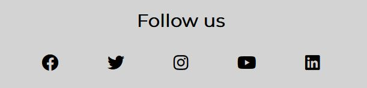

### About

- Provides the user with a Bio and outlines the ambitions of OCMii
- The image supports the text, and depict a professional setup  with well organised desk to convey efficiency and soberness of mind. This is to counteract the negative connotation of traditional beach and bikini shots.
- User stories covered: 1, 2, 3, 10, 13

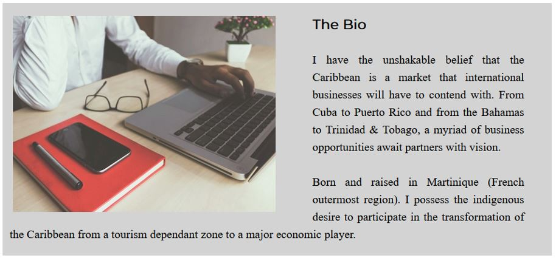

### Events

- Similarly to the new technology feature mentioned above, the events are presnting thre different workshops.
- On hover the Name of the event, its location and date are displayed. 
- whereas squares were chosen for technology, cirlcles are prefererd to depict human ceneterd workshops.  
- User stories covered: 4, 5, 7

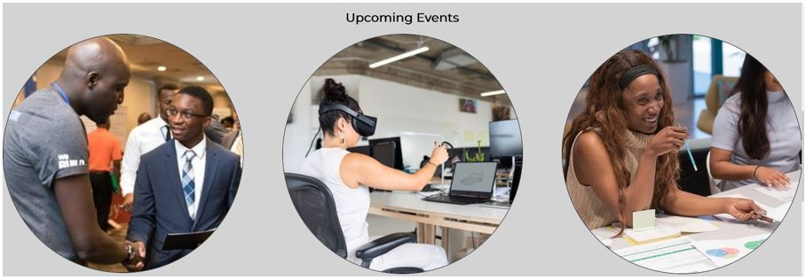

### Promo Video

- A YouTube video to promote A past event
- User stories covered: 4

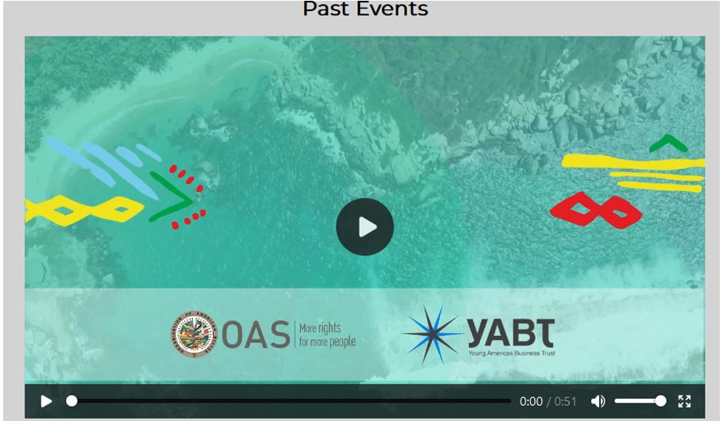

## Contact Us

### Form

- A form: allows the user to leave details and suggestions and the user can then be contacted. Each input is validated
- User stories covered 5,

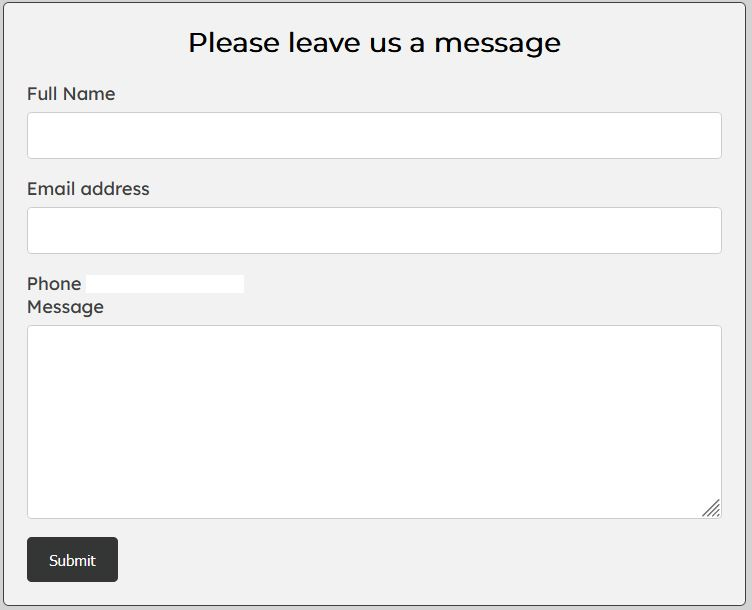

### Map

- Shows the location of OCMii headquarters on embedded Google Map
- User stories covered: 12

### Info Box

- Provides the user with information about the Location of OCMii address, phone number, email, 
- User stories covered: 8, 9, 12

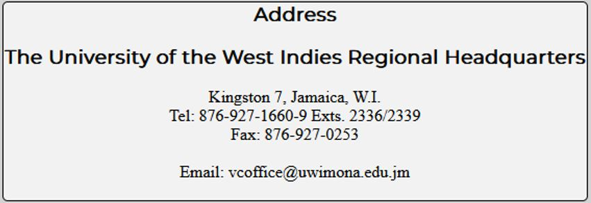

### 404 Error page

- Gives users a way out of the error page without having to close the window or navigating away from the site. It conains a link to the Main page.

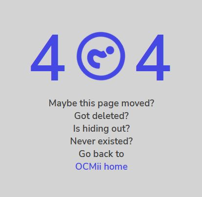

## Validation

### HTML Validation

To validate HTML code I used The W3C Markup Validation Service. The website passed with no errors. 

HTML

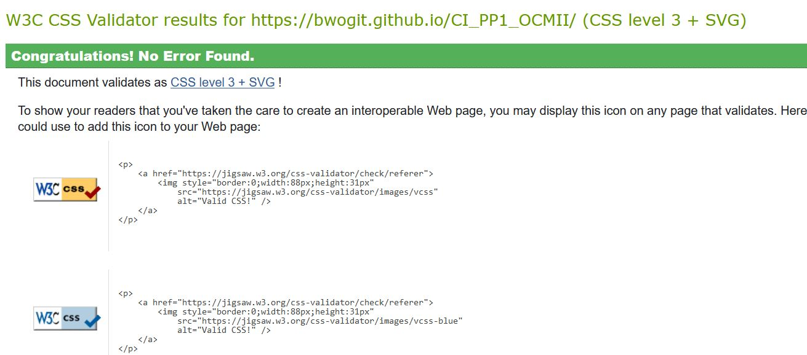

Main

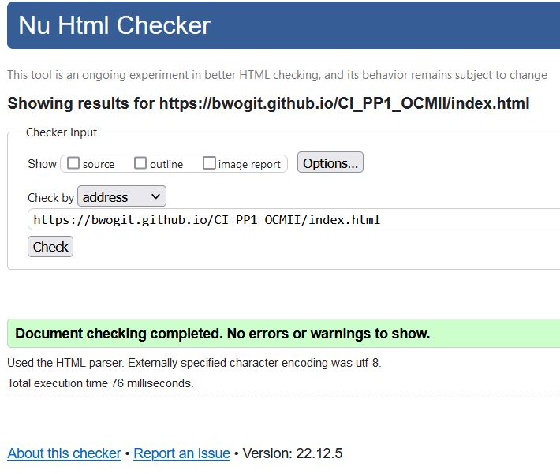

details>
About

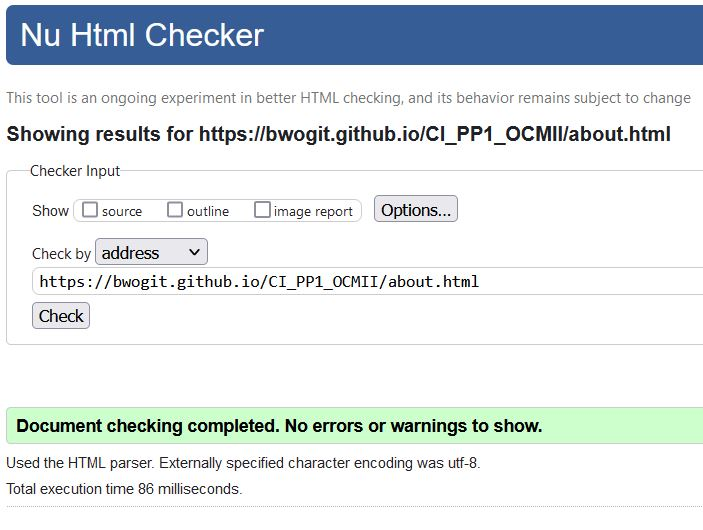

details>
Event

details>
Main

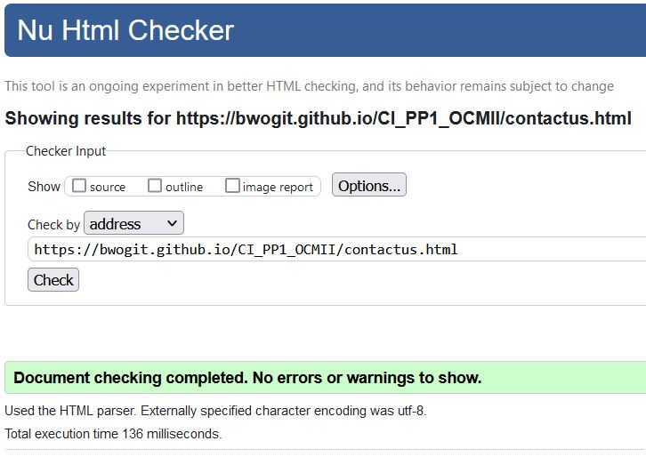

### 404 Validation
No errors were found for the 404.html page either.

404

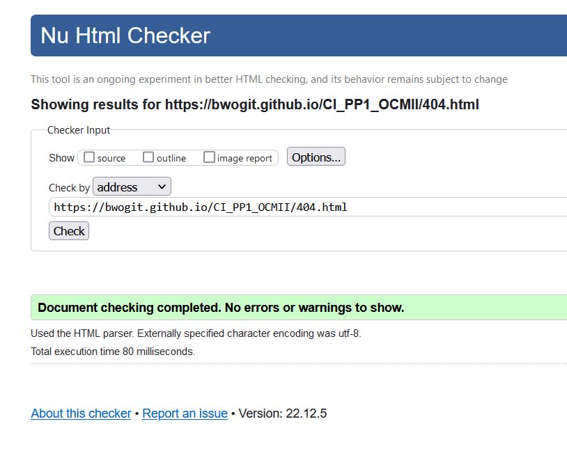

### CSS Validation
- I used The W3C Jigsaw CSS Validation Service. At first there were a couple of errors
    - end tags presents with no associated start tags
    - missing heading on section
- The errors were fixed and the the CSS file was tested again and subsequently passed with no errors

CSS

### Accessibility
- The WAVE WebAIM web accessibility evaluation tool was used to ensure the website met high accessibility standards. All pages pass with only 1 contrast error.
- EXCEPTION! the error cannot be fixed and is not really relevant. It concerns the toggle_checkbox for the hamburger menu which remains hidden and is not desigen to be seen by the user.
- EXEPTION2: Wave reports an accesssibitlity error due to teh presence of video file

wave

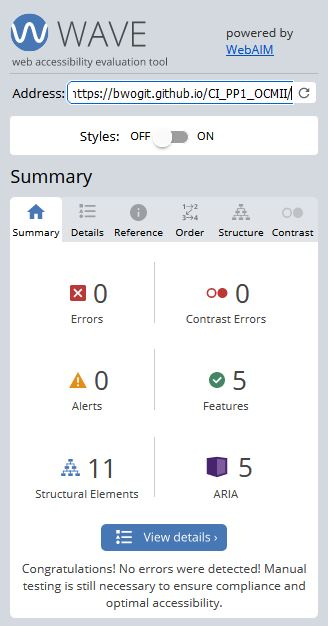

Main

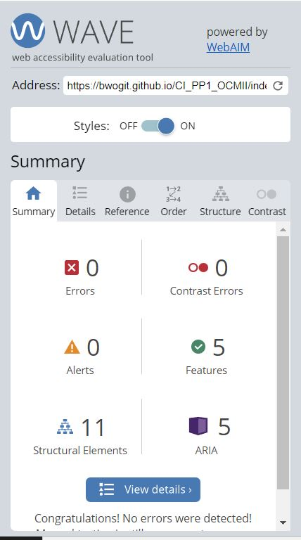

About

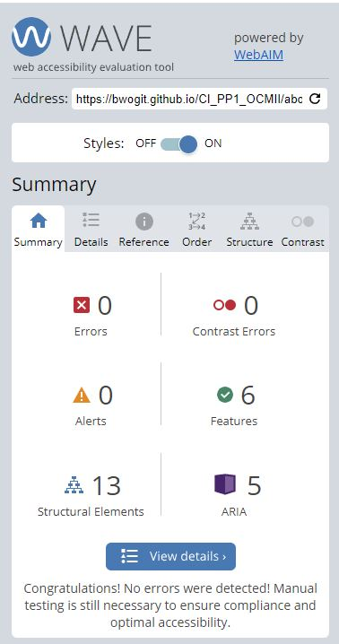

Events

Contact Us

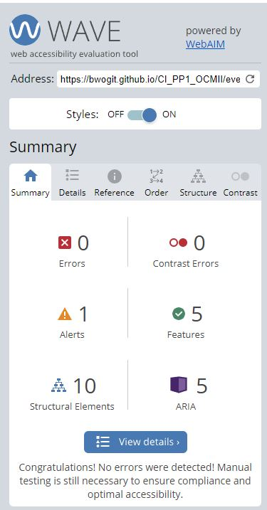

contrast error

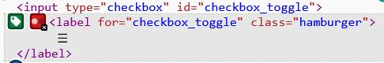

### Performance 
- I used the Google Lighthouse in Google Chrome Developer Tools to test the performance of the website. 

Main

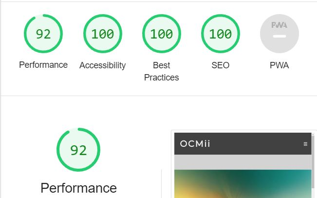

About

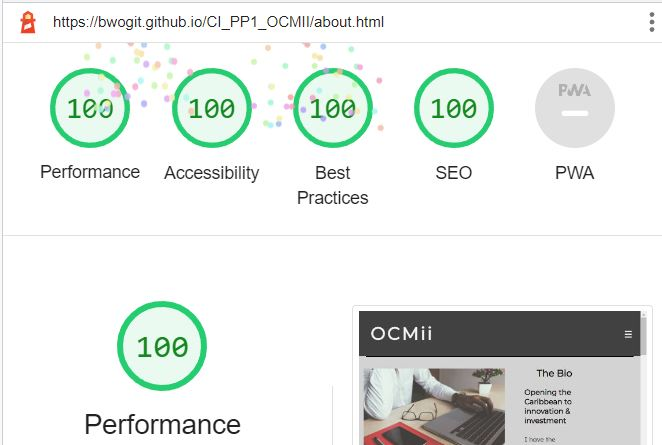

Events

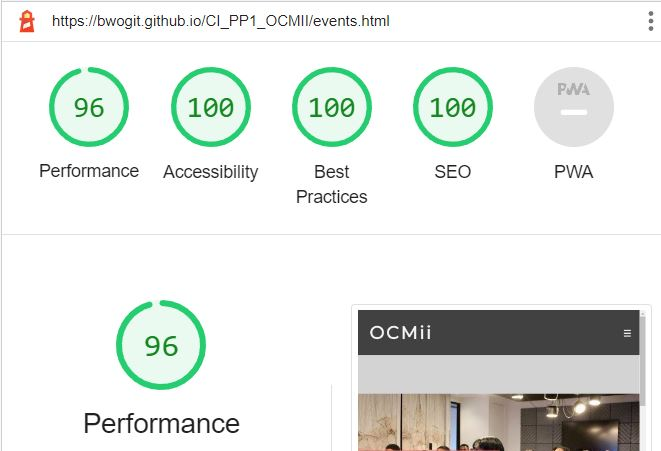

Contact Us

### testing the website 

Testing was done on the following devices:
- MacBook Pro
- iPhone 5
- iPad Air

### Browser compatibility

Testing was done on the following browsers:
- Brave
- Mozilla Firefox
- Google Chrome
- Microsoft Egde

### Testing user stories

1. As a first time user, I want to know what OCMii is about

| **Feature** | **Action** | **Expected Result** | **Actual Result** |
|-------------|------------|---------------------|-------------------|
| Bio | Navigate to the About page | Locating The Bio and read | Working |

Screenshots

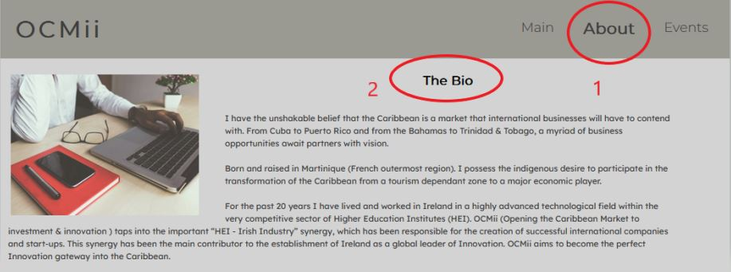

2. As a first time user, I want to know what OCMii wants to achieve

| **Feature** | **Action** | **Expected Result** | **Actual Result** |
|-------------|------------|---------------------|-------------------|
| Bio | Navigate to the About page and read out the Vision | Find Goal and strategy and ambition | Working |

Screenshots

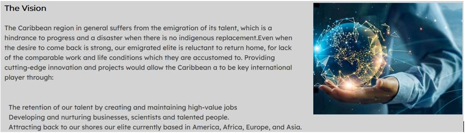

3. As a first time user, I want to know about how OCMii is going to achieve their goal

| **Feature** | **Action** | **Expected Result** | **Actual Result** |
|-------------|------------|---------------------|-------------------|
| Bio | Navigate to the About page and locate Solution and services | Read Info | Working |
| Events | Navigate to the Event Page, scroll down to look at upcoming events hover on the event | Find out location and time | Working |

Screenshots

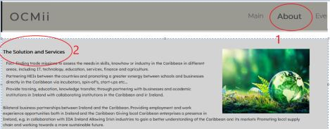

Screenshots

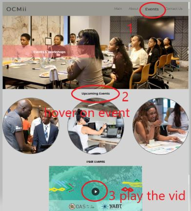

4. As a returning user, I want to see the past and next events and workshops

| **Feature** | **Action** | **Expected Result** | **Actual Result** |
|-------------|------------|---------------------|-------------------|
| Events | Navigate to Events | Find out about future events | working |
| video | Navigate to Events. Scroll down to locate the video | Find out about past events | working |

Screenshots

5. As a returning user, I want to be kept informed of latest announcements

| **Feature** | **Action** | **Expected Result** | **Actual Result** |
|-------------|------------|---------------------|-------------------|
| Events | Navigate to Events. Locate upcoming events | Find out about future events | working |
| New Technologies | Navigate to Main Locate new technologies | Find out about future tech | working |

Screenshots

Screenshots

6. As a returning user, I want to be able to leave comments and suggestions

| **Feature** | **Action** | **Expected Result** | **Actual Result** |
|-------------|------------|---------------------|-------------------|
|Contact Form|Navigate to the Contact Us Page fill out and submit|codeInstitute form validator success|success|

Screenshots

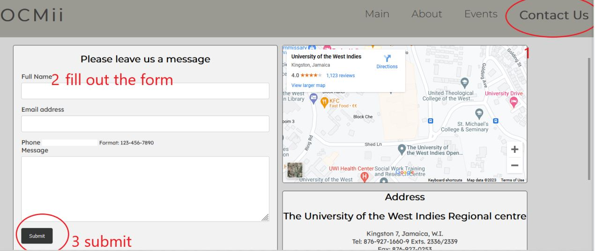

7. As a returning user, I want to find latest news on social media

| **Feature** | **Action** | **Expected Result** | **Actual Result** |
|-------------|------------|---------------------|-------------------|
| Footer| scroll down to the bottom of any page | Click on social media links | working |

Screenshots

8. As a returning user, I want to know how to get to OCMii

| **Feature** | **Action** | **Expected Result** | **Actual Result** |
|-------------|------------|---------------------|-------------------|
| map | Navigate to the Contact Us | Use the Google Map | Working |

Screenshots

9. As the site owner, I want users to know about upcoming events

| **Feature** | **Action** | **Expected Result** | **Actual Result** |
|-------------|------------|---------------------|-------------------|
| Contact Form | Navigate to the Contact Us Page and locate the contact form, fill out and submit contact form | Data submited via contact form | Works as expectd |
| Footer| scroll to the bottom of any page | Click on social media links | working |

Screenshots

Screenshots

10. As the site owner, I want users to get to feel they are Empowered by OCMii

| **Feature** | **Action** | **Expected Result** | **Actual Result** |
|-------------|------------|---------------------|-------------------|
| Hero Image (Main)| Navigate to Main | Be empowered by the moving picture | Working |
| Hero Image (Events)| Navigate to Event | Be empowered by the picture | Working |
| Footer| On any page scroll to the bottom | Click on social media links | Working |

Screenshots

Screenshots

| **Feature** | **Action** | **Expected Result** | **Actual Result** |
|-------------|------------|---------------------|-------------------|
| Map | Navigate to the Contact Us page, locate the map and click on directions link | See actual location on Goole Maps | Working |

11. As the site owner, I want our users to be able to contact us

| **Feature** | **Action** | **Expected Result** | **Actual Result** |
|-------------|------------|---------------------|-------------------|
| Info Box | Navigate to Contact Us locate the address details | Address/email/phone | success |

12. As the site owner, I want our users to be able to stay in touch with us

| **Feature** | **Action** | **Expected Result** | **Actual Result** |
|-------------|------------|---------------------|-------------------|
| Contact Us | Navigate to Contact Us | locate address/email/phone | success |

Screenshots

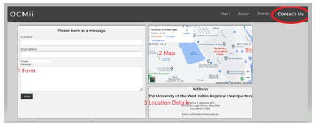

13. As the site owner, I want our users to know who is behind OCMii

| **Feature** | **Action** | **Expected Result** | **Actual Result** |
|-------------|------------|---------------------|-------------------|
| About | Navigate to the About page | Locating The Bio and read | Working |

Screenshots

14. As the site owner, I want our users to remain in the website even if a link is broken

| **Feature** | **Action** | **Expected Result** | **Actual Result** |
|-------------|------------|---------------------|-------------------|
| 404 | Scroll down the page to the link | Returning to the main page | Working |

Screenshots

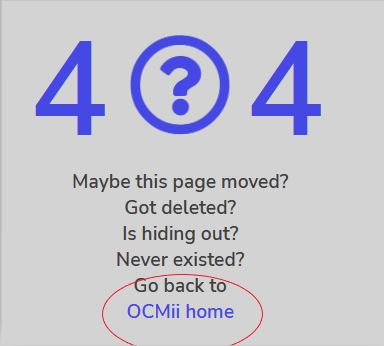

## Bugs

| **Bug** | **Fix** |
|---------|---------|
| On smaller devices, there is a grey zone on either side of the hero image on the Main page.  |not fixed! |
| On smaller devices, there is a grey zone on either side of the hero image on the Event page.  |not fixed! |

## Deployment

- I deployed the website through GitHub Pages as per below:
- (Source GitHub documentation here)

1.	Navigate to the Settings tab in CI_PP1_OCMII GitHub repository 
2.	On the left hand menu select Pages
3.	Select Branch: master as source
4.	After a few minutes the webpage refreshes automatically and the following notification appears "Your site is live at https://bwogit.github.io/CI_PP1_OCMII/ 

## How to fork this repository?

1.	Go to the CI_PP1_OCMII GitHub repository
2.	Click on Fork button in upper right hand corner

## How to clone this repository?

1.	Go to the CI_PP1_OCMII GitHub repository
2.	Click on Code button  
3.	Choose between  HTTPS, SSH, or Github CLI to copy the URL to your clipboard
4.	Launch Git Bash
5.	Select the directory
6.	Use command “git clone” and paste the URL from the clipboard as per following ($ git clone https://github.com/YOUR-USERNAME/YOUR-REPOSITORY) 
7.	Enter to generate your local clone.

## Credits

## Media
- Except from the main hero picture (created by me) All the pictures featuring on the website where taken from free high-quality repository: (Pexel and Unsplash ).
- the video was downloaded from YouTube https://www.youtube.com/watch?v=OV5AubhjJ1I

## Code

- The HTML for the responsive navigation bar with toggle was taken from [makeuseof](https://www.makeuseof.com/responsive-navigation-bar-using-html-and-css/) website documentation code snippet
- [Hero](https://getbootstrap.com/docs/5.0/components/carousel/#with-indicators) animation on index page was taken from **Code Institute** Love running demo website.
- Image overlay on hover inspired by [w3schools](https://www.w3schools.com/howto/howto_css_image_overlay.asp)
- 404 page was build using description on [GitHub Docs](https://docs.github.com/en/pages/getting-started-with-github-pages/creating-a-custom-404-page-for-your-github-pages-site)
- 404 code was taken from [creative blog](https://www.creativebloq.com/web-design/best-404-pages-812505)
- Google map [responsive](https://ostraining.com/blog/coding/responsive-google-maps/) from ostraining courses.

## Acknowledgements

- I would like to take the opportunity to thank:
- Above all God who never ever abandon me.
- CodeInstitute and LWETB for giving me this amazing opportunity
- My mentor Mo Shami for his feedback, advice, guidance and constant support.
- Myself for I have never worked so hard and learned so much in the process.

## Developper's note

- This is my very first website. I could not have predicted the sheer amount of work required to produce a profesional finished product. I have learned enough so far to know that if I were to start from scratch, I would do things differently. For instance document the work as I went along. It would have been easier. use a design framework like bootstrap. it would have resulted in a perhas cleaner result especially when debugging non-responsive elements. On to the next project!!!!!!

