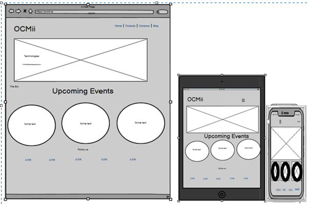

# OCMii
(developper : Jeremie Sandot)

[Live website](https://bwogit.github.io/CI_PP1_OCMII/)

## Table of Content

1. [Project Goals](#project_goals)
    1. [User Goals](#user_goals)
    2. [Site Owner Goals](#site_owner_goals)
2. [User Experience](#user_experience)
    1. [Target Audience](#target_audience)
    2. [User Requrements and Expectations](#user_requrements_and_expectations)
    3. [User Stories](#user_stories)
3. [Design](#design)
    1. [Design Choices](#design_choices)
    2. [Colour](#colours)
    3. [Fonts](#fonts)
    4. [Structure](#structure)
    5. [Wireframes](#wireframes)
4. [Technologies Used](#technologies_used)
    1. [Languages](#languages)
    2. [Frameworks & Tools](#frameworks-&-tools)
5. [Features](#features)
6. [Testing](#validation)
    1. [HTML Validation](#HTML_validation)
    2. [CSS Validation](#CSS_validation)
    3. [Accessibility](#accessibility)
    4. [Performance](#performance)
    5. [Device testing](#performing_tests_on_various_devices)
    6. [Browser compatibility](#browser_compatibility)
    7. [Testing user stories](#testing_user_stories)
8. [Gremlins](#Gremlins)
9. [Deployment](#deployment)
10. [Credit where credit is due](#credit_where_credit_is_due)
11. [Acknowledgements](#acknowledgements)

## Project Goals 

### User Goals
- To be informed of the ambitions of OCMii
- For the user to emancipate themselves from colonial vision of what is the Caribbean (beach, sand, coconut)
- To be empowered
- To be able to join us vibrant community and stay informed of future development
- Participate in OCMii’s events and workshops

### Site Owner Goals
- Provide a new vision for the Caribbean
- Be the changing force.
- Inspire the diaspora
- Introducing new technologies to the Caribbean
- Show what is OCMii and what are the values and goals
- Provide a platform for people to contact us.

## User Experience

### Target Audience

- People interested in developing the Caribbean
- People from the Caribbean living in the Caribbean and abroad.
- Angels Investors
- Universities

### User Requrements and Expectations

- A picture is worth a thousand words
- Intuitive navigation system
- Each picture is able to create a very profound emotion
- Simple way to get in touch with the business
- The message can be read at a glance irrespective of the device used.

### User Stories

#### First-time User

1. As a first time user, , I want to know what OCMii is about
2. As a first time user, I want to know what OCMii wants to achieve
3. As a first time user, I want to know about how OCMii is going to achieve their goal

### Returning User

4.	As a returning user, I want to see the past and next events and workshops
5.	As a returning user, I want to be kept informed of latest announcements
6.	As a returning user, I want to be able to leave comments and suggestions
7.	As a returning user, I want to find latest news on social media
8.	As a returning user, I want to know who is behind OCMii
9.	As a returning user, I want to know how to get to OCMii

#### Site Owner 

10.	As the site owner, I want users to know about upcoming events
11.	As the site owner, I want users to get to feel they are part of the OCMii
12.	As the site owner, I want our users to be able to contact us
13.	As the site owner, I want our users to be able to stay in touch with us

## Design

### Design Choices

I designed the site as a means to empower the Caribbean native both at home and abroad. Too long has the tragic history of the region shaped our lives! Each picture is telling a specific story and there are almost no words required. 
Furthermore, each image description will enhance the feeling of empowerment the user gets when using the website! It is about technology, future, embracing the change and control our destiny. 

### Colour

The website is sober and non-aggressive. The site is purposely neutral with dark grey and light grey being the common colours. The advantage of this choice of colours is to make the pictures jump. The focus of teh user is always on the pictures and information the websites provides.

### Fonts

I used Lexend for the body and Montserrat for headings. Both fonts are dyslexia friendly. 

### Structure

The structure of the page follows a well-known recognizable pattern. Logo on the left and navigation bar on the right.
The website consists of four separate pages:
- A Main page with a picture that show the sun rising on a new Caribbean that has embraced new technologies
- An About page which explains the goals of the OCMii
- An Events page with upcoming events and description
- A Contact Us page with a form, a google map and address information to contact the OCMii

### Wireframes

Home

About

Events

Contact Us

404

## Technologies Used

### Languages
- HTML
- CSS

### Frameworks & Tools
- Git
- GitHub
- Gitpod
- Paint.NET
- Balsamiq
- Google Fonts
- Font Awsome
- Favicon.io

## Features
The page consists of four pages and twelve features

### Logo and Navigation Bar

- Present on all four pages
- It simplifies the navigation
- The user knows which pages they are on by looking at the navigation bar.
- The navbar is fully responsive ans switches to a hamburger menu.
- When a user is on a page the link is displayed in bold in the navbar

